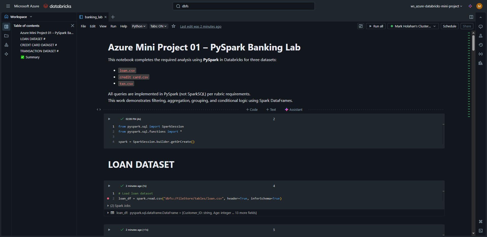
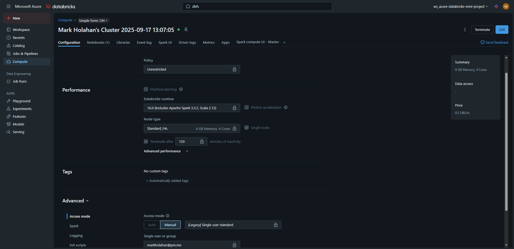

# Azure DataBricks Mini Project

## 📖 Abstract
This project demonstrates how to use Azure Databricks and PySpark to explore and transform financial transaction data. The provided lab notebook (banking_lab.dbc) contained a series of prompts guiding the construction of PySpark DataFrame operations to query, filter, and aggregate customer banking data.

Within Databricks, I imported the notebook into my workspace and iteratively implemented PySpark solutions to answer questions such as filtering transactions by type, grouping by account attributes, and aggregating customer activity. The emphasis was on applying PySpark DataFrame APIs rather than SparkSQL, building fluency with Spark’s Pythonic interface.

The exercise culminated in a completed Databricks notebook that illustrates core data engineering skills: data ingestion, transformation, aggregation, and query design in PySpark. Along the way, I deepened my understanding of PySpark syntax, DataFrame query patterns, and Databricks’ cloud-native development environment.

This project highlights how Spark-based data engineering is performed in the cloud, bridging Python workflows with distributed compute in Azure Databricks.

## 🛠 Requirements
- Azure account with Databricks workspace provisioned
- Databricks Community Edition or paid subscription
- Banking_lab.dbc file (provided project file)
- Installed locally (for testing outside Databricks):
  - pyspark >= 3.3.0
  - ipython
  - jupyter
  - pandas

## 🧰 Setup
- From Azure Home, "Azure Services," choose "Azure Databricks"
- Follow wizard to stand-up a Databricks instance (you will need to create a cluster resource too for compute).
- Launch Azure Databricks workspace
- Navigate to your "Users" directory
- Choose a user
- Right-click → Import → Upload the DBC file
- Click on the "banking_lab" notebook to open
- In the "banking_lab" notebook UI, look for a menu at the top ("File Edit View Run...")
- Choose File → Upload Data to DBFS. This opens a new "Upload Data" window
- Drag and Drop 3 CSVs. The target path will be: /FileStore/shared_uploads/<user name>/
- You can use "dbutils.fs" commands once in the notebook to manage DBFS files

## 📊 Dataset
- Banking_lab.dbc contains sample banking data for analysis
- Structured to allow PySpark DataFrame operations and queries
- No external CSVs or APIs required; dataset bundled within .dbc archive

## ⏱️ Run Steps
- Open the imported notebook in Databricks
- Fill in Python and PySpark code where # TODO comments are indicated
- Execute cells sequentially to complete all analysis prompts
- Save completed notebook and export as .dbc for submission

## 📈 Outputs
- Completed Databricks notebook with PySpark code
- Results of DataFrame transformations and queries
- Exported .dbc file for submission

## 📸 Evidence

  
Screenshot of Databricks notebook in workspace

  
Screenshot of Databricks cluster configuration

## 📎 Deliverables

- [`banking_lab.ipynb`](./deliverables/banking_lab.ipynb)

- [`requirements.txt`](./deliverables/requirements.txt)

- [`README`](./deliverables/README)

## 🛠️ Architecture
- Azure Databricks environment hosting PySpark notebooks
- Cluster-based execution of Spark DataFrame queries
- Local dependencies only required for optional testing

## 🔍 Monitoring
- Databricks job UI shows execution status
- Spark UI available for performance inspection of transformations

## ♻️ Cleanup
- Remove imported notebook from Databricks if no longer needed
- Shut down or delete Databricks cluster to avoid unnecessary charges

*Generated automatically via Python + Jinja2 + SQL Server table `tblMiniProjectProgress` on 09-17-2025 14:55:50*